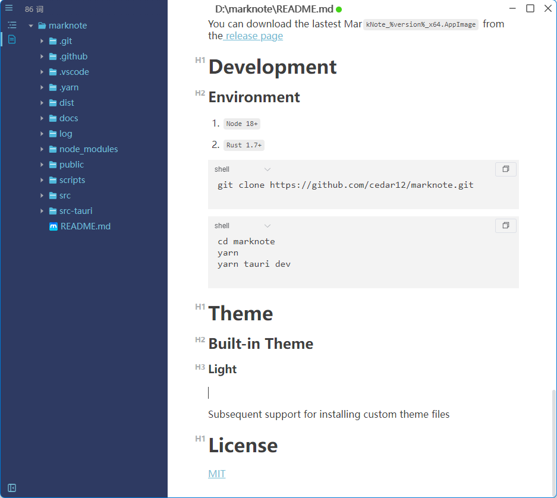

# MarkNote

[](https://github.com/cedar12/marknote/actions/workflows/release.yml)

🎉一个简单的所见即所得的 Markdown 编辑器，适用于 Linux、macOS 和 Windows。

---

# 功能

- 比 electron系 体积更小、运行更快、更加安全
- 多窗口
- 多主题，支持自定义主题
- 支持 CommonMark 规范、GitHub 风格的 Markdown 规范
- 支持段落和内联样式快捷方式
- 文档字符和单词统计
- 支持从剪贴板粘贴图像和拖动外部图像进行插入
- Markdown 扩展，如数学表达式（KaTeX）和Mermaid图表
- 支持导出图像、HTML 和 PDF 文档
- 支持图床[PicGO](https://molunerfinn.com/PicGo/)

# 界面


# 下载

> 国内github下载慢、以下下载链接使用了 `gh-proxy` 代理

### Windows

[MarkNote_0.0.7_x64_en-US.msi](https://gh-proxy.com/https://github.com/cedar12/marknote/releases/download/v0.0.7/MarkNote_0.0.7_x64_en-US.msi)

### MacOS

英特尔芯片

[MarkNote_0.0.7_x64.dmg](https://gh-proxy.com/https://github.com/cedar12/marknote/releases/download/v0.0.7/MarkNote_0.0.7_x64.dmg)

苹果M系芯片

[MarkNote_0.0.7_aarch64.dmg](https://gh-proxy.com/https://github.com/cedar12/marknote/releases/download/v0.0.7/MarkNote_0.0.7_aarch64.dmg)

### Linux

[mark-note_0.0.7_amd64.deb](https://gh-proxy.com/https://github.com/cedar12/marknote/releases/download/v0.0.7/mark-note_0.0.7_amd64.deb)

[mark-note_0.0.7_amd64.AppImage](https://gh-proxy.com/https://github.com/cedar12/marknote/releases/download/v0.0.7/mark-note_0.0.7_amd64.AppImage)

# 开发

## 环境要求

1. `Node 18+`
2. `Rust 1.7+`

```shell
git clone https://github.com/cedar12/marknote.git
```

```shell
cd marknote
yarn
yarn tauri dev
```

# 主题

## 内置主题

### Light



### Dark


## 自定义主题

### 安装主题

JSON主题文件需遵循Schema

```json
{
  "type": "object",
  "properties": {
	"label": {
	  "type":"string",
	  "title":"主题标签",
	},
	"value": {
	  "type":"string",
	  "title":"主题值",
	},
	"type": {
	  "type":"string",
	  "title": "主题类型",
	  "enum":["light","dark"]
	},
	"style": {
	  "type":"object",
	  "title": "主题样式",
	  "properties": {
		"primaryBackgroundColor": {
		  "type":"string",
		  "pattern":"^#([0-9A-Fa-f]{3}|[0-9A-Fa-f]{6}|[0-9A-Fa-f]{8})$"
		},
		"primaryBackgroundColorHover": {
		  "type":"string",
		  "pattern":"^#([0-9A-Fa-f]{3}|[0-9A-Fa-f]{6}|[0-9A-Fa-f]{8})$"
		},
		"primaryBackgroundColorActive": {
		  "type":"string",
		  "pattern":"^#([0-9A-Fa-f]{3}|[0-9A-Fa-f]{6}|[0-9A-Fa-f]{8})$"
		},
		"contentBackgroundColor": {
		  "type":"string",
		  "pattern":"^#([0-9A-Fa-f]{3}|[0-9A-Fa-f]{6}|[0-9A-Fa-f]{8})$"
		},
		"primaryTextColor": {
		  "type":"string",
		  "pattern":"^#([0-9A-Fa-f]{3}|[0-9A-Fa-f]{6}|[0-9A-Fa-f]{8})$"
		},
		"primaryTextColorHover": {
		  "type":"string",
		  "pattern":"^#([0-9A-Fa-f]{3}|[0-9A-Fa-f]{6}|[0-9A-Fa-f]{8})$"
		},
		"primaryTextColorActive": {
		  "type":"string",
		  "pattern":"^#([0-9A-Fa-f]{3}|[0-9A-Fa-f]{6}|[0-9A-Fa-f]{8})$"
		},
		"contentTextColor": {
		  "type":"string",
		  "pattern":"^#([0-9A-Fa-f]{3}|[0-9A-Fa-f]{6}|[0-9A-Fa-f]{8})$"
		},
		"primaryBorderColor": {
		  "type":"string",
		  "pattern":"^#([0-9A-Fa-f]{3}|[0-9A-Fa-f]{6}|[0-9A-Fa-f]{8})$"
		},
		"contentBorderColor": {
		  "type":"string",
		  "pattern":"^#([0-9A-Fa-f]{3}|[0-9A-Fa-f]{6}|[0-9A-Fa-f]{8})$"
		},
		"contentBackgroundColorActive": {
		  "type":"string",
		  "pattern":"^#([0-9A-Fa-f]{3}|[0-9A-Fa-f]{6}|[0-9A-Fa-f]{8})$"
		},
		"contentBackgroundColorHover": {
		  "type":"string",
		  "pattern":"^#([0-9A-Fa-f]{3}|[0-9A-Fa-f]{6}|[0-9A-Fa-f]{8})$"
		},
		"contentTextColorActive": {
		  "type":"string",
		  "pattern":"^#([0-9A-Fa-f]{3}|[0-9A-Fa-f]{6}|[0-9A-Fa-f]{8})$"
		},
		"contentTextColorHover": {
		  "type":"string",
		  "pattern":"^#([0-9A-Fa-f]{3}|[0-9A-Fa-f]{6}|[0-9A-Fa-f]{8})$"
		}
	  }
	}
  }
}
```

### 卸载主题

从themes目录中删除JSON主题文件

# 许可

[MIT](https://github.com/cedar12/marknote/blob/main/LICENSE)
