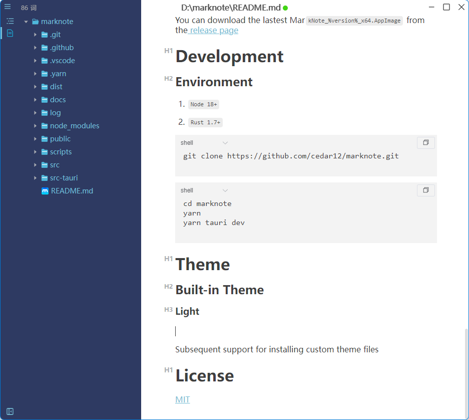
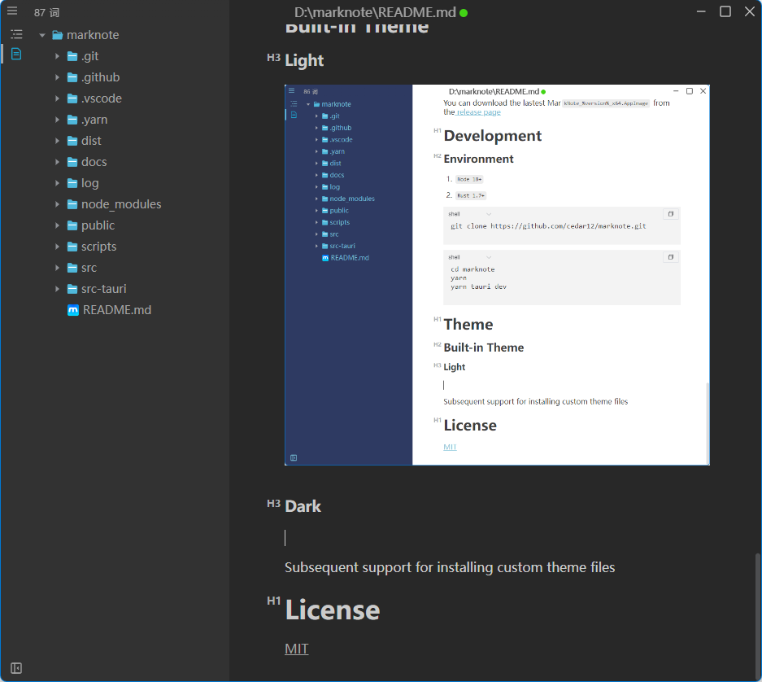

# MarkNote

[](https://github.com/cedar12/marknote/actions/workflows/release.yml)

🎉A simple `WYSIWYG` markdown editor, available for Linux, macOS and Windows.

---

# Features

- Multiple Window
- Multiple Themes, Support for custom themes
- Support CommonMark Spec, GitHub Flavored Markdown Spec
- Support paragraphs and inline style shortcuts
- Document Character and Word Statistics
- Supports pasting images from the clipboard and dragging external images for insertion
- Markdown extensions such as math expressions (KaTeX) and Mermaid Chart
- Support for exporting images, HTML, PDF, and Word (.docx) documents
- [PicGO](https://molunerfinn.com/PicGo/)

# Preview


[Complete Markdown example preview](docs/marknote.jpg)

# Download

### Windows

You can download the lastest `MarkNote_%version%_x64-setup.exe` or `MarkNote_%version%_x64-en-US.msi` from the [release page](https://github.com/cedar12/marknote/releases/latest)

### MacOS

You can download the lastest `MarkNote_%version%_x64.dmg` from the [release page](https://github.com/cedar12/marknote/releases/latest)

### Linux

You can download the lastest Mar`kNote_%version%_x64.AppImage` from the [release page](https://github.com/cedar12/marknote/releases/latest)

# Development

## Environment

1. `Node 18+`
2. `Rust 1.7+`

```shell
git clone https://github.com/cedar12/marknote.git
```

```shell
cd marknote
yarn
yarn tauri dev
```

# Keyboard shortcuts

Open Preferences → Keyboard shortcuts, focus a field, and press a key combination to configure file, edit, format, paragraph, and view actions. Clear assignments, restore defaults, and resolve conflicts before choosing Save shortcuts. Changes apply immediately, synchronize across windows, and persist after restarting.

# Math block and Mermaid source

Select a math block or Mermaid diagram to show the source and copy buttons in the top right. Expand the source to edit it, or copy its raw text. Both source editors use the same code theme and styling; empty math blocks accept formula input immediately.

# Editor font

Open Preferences → Editor to choose system default, sans serif, serif, or monospace, or enter an installed font name and press Enter. Body size supports 12–32 px, with a live preview and Restore default font. Settings apply immediately, save automatically, and synchronize across windows while retaining document content and undo history. Unavailable fonts fall back to the system default; code keeps its monospace font.

# Image export

Use File → Export → Image to configure PNG or JPEG, document width, 1× / 2× resolution, background, and JPEG quality. The default 1× prioritizes speed; PNG supports transparency. Export includes the complete document, including all large-file segments, and uses the selected editor font. Settings remain available for retry after a failure.

# Markdown settings

Open Preferences → Markdown to configure single line breaks, link recognition, smart punctuation, HTML parsing, compact lists, bullet markers, and Markdown conversion on paste/copy. Settings save automatically and synchronize across windows.

Parsing settings apply to newly opened documents, pasted text, and loaded segments while retaining the current content, selection, and undo history. Output settings apply to future saves and copies; untouched large-file segments retain their original source. Paste As Plain Text and Copy As Plain Text keep plain-text behavior.

# Theme

## Built-in Theme

### Light



### Dark



## Custom Theme

### Install Theme

Open Preferences → Theme, select Install theme file, and choose a UTF-8 JSON file. Select the installed theme from the list to apply it. Installed themes are copied to the application data directory's `themes` folder (usually `%APPDATA%/com.github.marknote/themes` on Windows); the original file is retained.

Files can be up to 1 MiB and must include every field below. `label` is a nonempty name of 1–128 Unicode characters without control characters. `value` contains 1–128 ASCII letters, digits, hyphens, or underscores. `type` is `light` or `dark`. All 14 colors must use `#RGB`, `#RRGGBB`, or `#RRGGBBAA` notation. Additional fields are rejected.

Theme IDs are unique regardless of case. Duplicate installations are rejected, and `light` / `dark` are reserved IDs.

~~~json
{
  "label": "My Light Theme",
  "value": "my-light",
  "type": "light",
  "style": {
    "primaryBackgroundColor": "#2e3a62",
    "primaryBackgroundColorHover": "#334789",
    "primaryBackgroundColorActive": "#1f294a",
    "primaryTextColor": "#74bcd4",
    "primaryTextColorHover": "#4fb8db",
    "primaryTextColorActive": "#1e9fca",
    "primaryBorderColor": "#52b5f9",
    "contentBackgroundColor": "#ffffff",
    "contentBackgroundColorActive": "#ececec",
    "contentBackgroundColorHover": "#ececec",
    "contentTextColor": "#3e3e3e",
    "contentTextColorActive": "#4e4e4e",
    "contentTextColorHover": "#c4c4c4",
    "contentBorderColor": "#babec1"
  }
}
~~~

### Uninstall Theme

Select Uninstall below an installed theme and confirm. Removing the active theme applies the built-in theme of the same type in every window. Built-in and bundled themes cannot be uninstalled. Cancelling a picker or confirmation preserves the theme; file failures show a recoverable error.

# License

[MIT](https://github.com/cedar12/marknote/blob/main/LICENSE)
